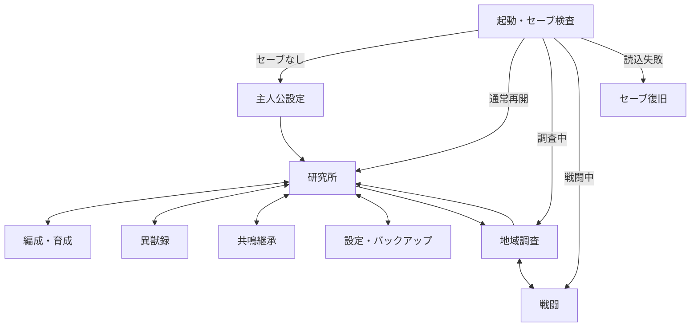

# 『封域異獣録』画面遷移設計

版：0.1  
更新日：2026年7月13日  
対象：縦切り版

## 1. 採用方針

大画面の遷移にはReact RouterのDeclarative Modeと `HashRouter` を使用する。画面内の細かな操作はURLへ持たせず、Reactのローカル状態または `GameSession` で管理する。

```text
URLで表すもの
  研究所／編成／異獣録／探索／戦闘／共鳴継承／設定

URLで表さないもの
  選択中の技能／3体分の未確定行動／ダイアログ／演出段階／一時プレビュー
```

URLは「どの大画面を表示するか」だけを表す。ゲーム進行の正しい状態はセーブデータと `GameSession` が持ち、URLだけで報酬、戦闘、仲間化などを成立させない。

## 2. HashRouterを選ぶ理由

`HashRouter` はURLの `#` 以降へ画面位置を保存し、その部分をサーバーへ送信しない。静的ファイルを配信するホスティングでも、個別URLを開いた際のサーバー側フォールバック設定を必要としない。

本作ではURLの見栄えより、次を優先する。

- 無料または簡素な静的ホスティングへ配置しやすい
- PWAの全画面を常に同じ `index.html` から起動できる
- iPhoneの戻る操作とブラウザー履歴を利用できる
- 将来ホスティング先を変更しやすい

画面遷移、リンク、現在地の判定だけが必要なため、React RouterのData ModeやFramework Modeは使用しない。ゲームデータの読込みは `GameSession` とDexieが担当する。

## 3. ルート構成

| URL | 画面 | 備考 |
|---|---|---|
| `#/` | 起動判定 | セーブ読込後、適切な再開先へ置換遷移 |
| `#/new-game` | 主人公設定 | セーブがない場合だけ開始可能 |
| `#/laboratory` | 研究所 | 通常時のホーム画面 |
| `#/party` | 編成・育成 | 所有異獣と前衛・控えの管理 |
| `#/bestiary` | 異獣録一覧 | 調査段階、絞込み、未確認更新 |
| `#/bestiary/:speciesId` | 異獣録詳細 | 種IDだけをURLへ持つ |
| `#/exploration/:regionId` | 地域調査 | 地点選択と短い分岐 |
| `#/battle` | 戦闘 | 戦闘内容は `GameSession` から取得 |
| `#/resonance` | 共鳴継承 | 基体、相手、触媒、継承内容の選択 |
| `#/settings` | 設定 | 音量、表示、バックアップ |
| `#/recovery` | セーブ復旧 | 読込・移行失敗時の安全画面 |
| `*` | 不明URL | 状態検査後、安全な画面へ置換遷移 |

戦闘ID、敵HP、乱数シード、所持素材、物語フラグなどはURLへ含めない。

## 4. 画面の関係



## 5. 起動時のルート決定

アプリ起動直後はURLを先に信用せず、セーブを読み込んでから表示先を決める。

優先順は次のとおり。

1. セーブの読込または移行に失敗した場合は `#/recovery`
2. 有効なプロフィールがない場合は `#/new-game`
3. 再開可能な戦闘がある場合は `#/battle`
4. 調査中の場合は `#/exploration/:regionId`
5. それ以外は、要求された安全な大画面または `#/laboratory`

自動的な補正遷移は履歴を増やさず、`replace` で現在位置を置き換える。起動判定画面へ戻り続ける履歴ループを作らない。

## 6. ルートガード

### 主人公設定

既存プロフィールがある状態で `#/new-game` を直接開いても、即座に初期化しない。研究所へ戻し、初期化は設定画面の確認操作からのみ行う。

### 地域調査

- URLの地域IDが存在するか確認する
- 解放されていない地域を直接開いても開始しない
- 調査中の地域とURLが異なる場合は、保存済みの調査地域へ補正する
- 地点や報酬はURLではなく進行状態から決める

### 戦闘

- 再開可能な戦闘状態がある場合だけ表示する
- 戦闘状態がなければ、調査中の地域または研究所へ置換遷移する
- URLを再読込しても新しい敵や報酬を生成しない
- 戦闘開始はゲームコマンドで確定してから `#/battle` へ移る

### 共鳴継承

- URLから個体IDや触媒IDを指定しない
- 選択内容は未確定プレビューとして画面内に保持する
- 実行条件を満たさない場合でも、所有データを変更せず説明を表示する

## 7. 戻る操作

### 通常画面

研究所、編成、異獣録、設定などの移動には通常の履歴を使う。画面上の「戻る」は、戻り先が明確な場合には研究所や一覧などの親画面を明示して遷移する。

履歴が存在する保証のない直接起動後に、無条件で `navigate(-1)` を実行しない。外部サイトや空の履歴へ戻る可能性を避ける。

### 未確定入力がある画面

編成変更、共鳴継承プレビュー、主人公名入力などが未確定の場合は、React Routerの `useBlocker` でアプリ内遷移を止め、次を選べる独自ダイアログを表示する。

- 編集を続ける
- 未確定内容を破棄して移動する

ブラウザー標準の確認文に依存せず、ゲーム内の用語で説明する。

### 戦闘中

iPhoneの戻る操作だけで戦闘を離脱させない。アプリ内遷移をブロックし、「戦闘へ戻る」またはゲームルール上許可された「調査を中断する」を明示的に選ばせる。

ハードリロードやアプリ終了はルーターだけでは防げないため、戦闘ラウンド解決後の自動保存から安全に再開する。

## 8. 画面内状態とURLの境界

| 操作・状態 | URL | GameSession | UI一時状態 |
|---|---:|---:|---:|
| 研究所から異獣録へ移る | ○ | － | － |
| 異獣の種詳細を開く | ○ | － | － |
| 異獣録の一時フィルター | 任意 | － | ○ |
| 地域調査を開始する | ○ | ○ | － |
| 調査地点を確定する | － | ○ | － |
| 3体分の戦闘行動を選ぶ | － | － | ○ |
| 戦闘ラウンドを確定する | － | ○ | － |
| 技能説明を開く | － | － | ○ |
| 共鳴結果を試算する | － | － | ○ |
| 共鳴継承を確定する | － | ○ | － |

URLの `location.state` は補助的な戻り先や演出指定にだけ使用し、ゲーム進行の必須情報を置かない。ページ再読込で失われてもゲーム状態が壊れないことを条件とする。

## 9. PWAとの関係

- Manifestの `start_url` はアプリのルートを指す
- 起動時は `#/` からセーブ状態に応じて再開先を決める
- HashRouterのため、サーバーへ要求される文書パスは常にアプリのルートになる
- Service Workerは `index.html` とルーター本体をオフライン利用可能にする
- 通知や外部リンクから直接ゲーム進行を変更する仕組みは縦切り版に入れない
- 新版適用後も、旧URLではなくセーブ状態を基準に安全な再開先を選ぶ

## 10. アクセシビリティと操作

- 現在の大画面名を見出しとして表示する
- 遷移後は画面先頭または主見出しへフォーカスを移す
- 戻るボタンはアイコンだけでなく読み上げ名を持つ
- 選択中の主要タブは色以外でも示す
- ダイアログ表示中は背後画面へフォーカスを移さない
- iPhoneの安全領域を考慮し、下部ナビゲーションをホームインジケータへ重ねない

## 11. テスト項目

- 全ルートを直接開いてもクラッシュしない
- セーブなしで保護画面を開くと主人公設定へ補正される
- 戦闘中の再読込で同じ確定ラウンドから再開する
- URLを変更しても未解放地域や報酬を取得できない
- 未確定の編成や共鳴プレビューで戻ると確認が表示される
- 確認を取り消すと入力内容が残る
- 起動時の自動補正で履歴ループが起きない
- 不明な種IDや地域IDを安全に処理する
- オフライン起動後も内部リンクが動作する
- iPhoneのスワイプによる戻る操作で戦闘を意図せず離脱しない

## 12. 公式資料

- [React Router：Picking a Mode](https://reactrouter.com/start/modes)
- [React Router：Routing](https://reactrouter.com/start/declarative/routing)
- [React Router：HashRouter](https://reactrouter.com/api/declarative-routers/HashRouter)
- [React Router：useBlocker](https://reactrouter.com/api/hooks/useBlocker)
- [React Router：useNavigate](https://reactrouter.com/api/hooks/useNavigate)

## 13. 次に決めること

通常時は研究所、編成、異獣録を下部の主要導線とし、共鳴継承と設定は研究所から開く。探索と戦闘は下部タブを隠した集中画面とする。詳細は [画面構成設計.md](./画面構成設計.md) を参照する。

UIの視覚表現は [ビジュアルデザイン.md](./ビジュアルデザイン.md)、画面の具体化は [画面構成設計.md](./画面構成設計.md) と [研究所ホーム設計.md](./研究所ホーム設計.md)、常駐人物と会話表示は [登場人物設定.md](./登場人物設定.md) を参照する。次はPWA技術スパイクへ進む。
